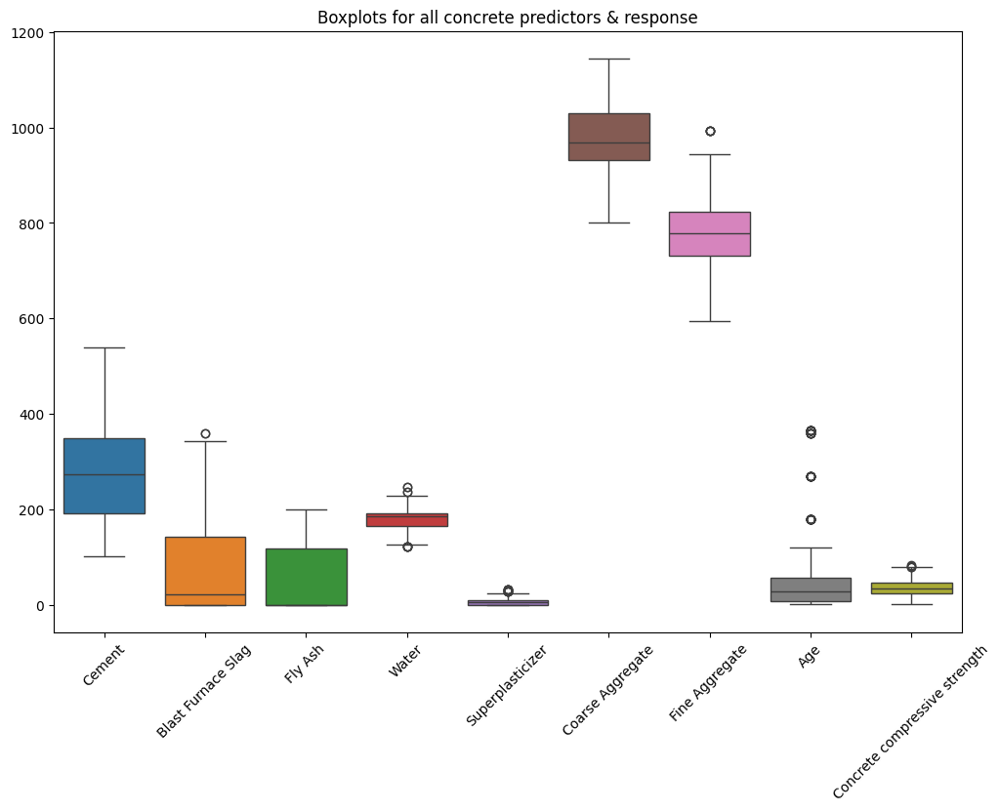
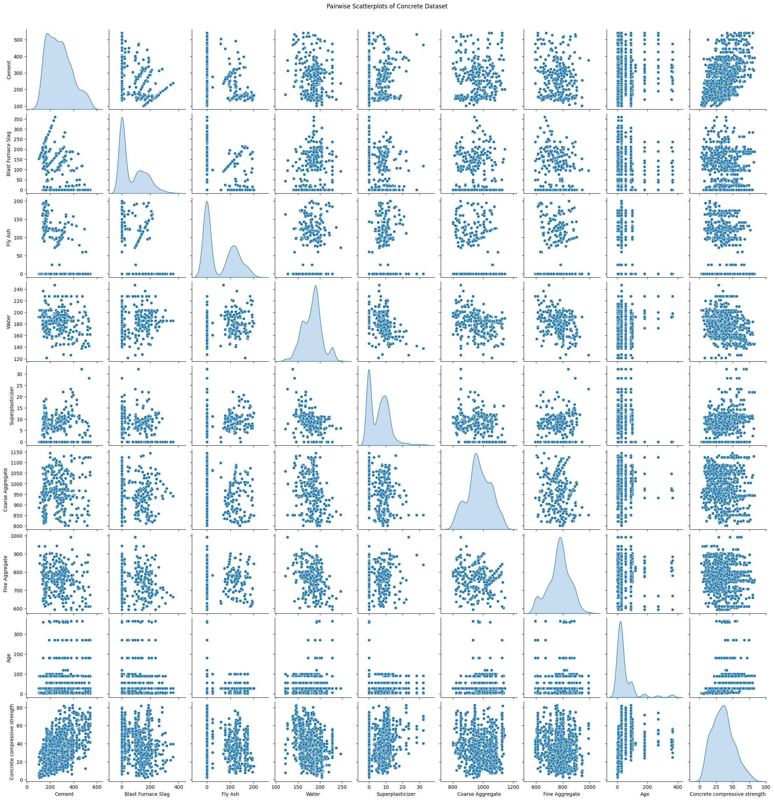

# CS 598 Project 2 Report

Completed by Zarmeen Hasan

## Introduction

This report goes through the steps I took to find the best performing model to predict the compressive strength of concrete given its ingredients and curing age. Based of the assignment's instructions, I tested the following regression-type models: polynomial regression, splines, regression trees, and Random Forest. To train and test the models, I used the Concrete Compressive Strength dataset from the  UCI Repository.

The dataset consists of nine variables including the target variable (`Concrete compressive strength`) and eight predictors. Seven of the predictors (`Cement`, `Blast Furnace Slag`, `Fly Ash`, `Water`, `Superplasticizer`, `Coarse Aggregate`, `Fine Aggregate`) are the amount, in kg/m², of each ingredient used in the concrete mixture. The final predictor is `Age`, which is the age of the concrete when the strength was measured.

## Data Cleaning Process

I imported the data directly from the `ucimlrepo` package. THe data itself was already fairly clean. The data source already confirmed that there were no missing values on their website.

### Outliers

I first decided to take a look at outliers using box plots for all the variables. This also helped me view the variables' distributions.

From the plot, I could see there were a few outliers in the `Water`, `Superplasticizer`, `Fine Aggregate`, and `Age` predictors. There was also one outlier in the target variable. I decided to leave the outliers in the data because regression trees and Random Forest are very robust to outliers. Polynomial regression and splines do not handle outliers very well, but since regression trees adn Random Forest perform better, in general, compared to the other two models, I decided to just keep the outliers in the data. I did notice that the scales of the variables differ by a lot, which I dealt with later on.

### Duplicate Rows in Data

I next checked the data for any duplicate rows. Duplicate rows inflate the sample size and it is usually best practice to delete duplicates. I identified 25 duplicate rows, which I removed from the data. I made sure to keep the first instance of each duplicate, so the record was still used in the modeling process.

### Data Types

Though all the variables are continuous and numerical, I wanted to make sure they were all of the same type. In Python, integers can behave unexpectedly, especially when working with mainly float values. The `Age` predictor was the only variable of type `int64` whereas the others were all `float64`. I converted `Age` to float so it matched the other predictors' data type.

### Distribution and Relationships Between Variables

I used a pairwise scatter plot to easily and concisely view the distributions of all the variables and their relationships with one another.

After seeing the distributions of the variables in both the box plot and this pairwise plot, I decided it would be best to standardize the variables to prevent unfair estimations of coefficients. Ensuring all variables have a mean of 0 and a standard deviation of 1 and contribute equally to the model. This is important for polynomial regression and splines for stability and smoothness. To do this, I used the `sklearn.preprocessing StandardScaler` class when training my polynomial regression and splines models.

As for distributions of the data, I noticed some correlation among the ingredient variables. I decided to take no action for this because trees handle multicollinearity well.

## Data Analysis and Model Selection

Prior to modeling, I randomly split my data into 30% testing and 70% training.

### Polynomial Regression

I fit five separate polynomial regressions with degrees between 1 and 5. Degrees 1–5 were chosen to explore a reasonable range of model flexibility — from a simple linear relationship (degree 1) to increasingly complex nonlinear fits (degrees 2–5). After fitting the models, I used test mean squared error (MSE) to evaluate the 5 models. These were the results:

| Degree | Test MSE      |
| ------ | ------------- |
| 1      | 97.88         |
| 2      | 58.07         |
| 3      | 53.90         |
| 4      | 12,207,566.33 |
| 5      | 1,722,644.37  |

Based on these results, the polynomial model with degree 3 is the best fitting model for polynomial regression.

### Splines

I next tested splines. I chose cubic splines (degree = 3) because they offer a good trade-off between smoothness and flexibility. They allow the fitted function to model nonlinear relationships without the instability associated with higher-degree polynomials, while ensuring smooth transitions at knot points.

I fit several cubic spline regression models with a different number of knots: 3, 5, 7, 9, and 12. Varying the number of knots controls the model’s flexibility — fewer knots produce smoother fits with higher bias, while more knots allow the model to capture finer details in the data but increase the risk of overfitting.

Each spline model was fit using a standardized version of the predictors, and test mean squared error was used to evaluate performance. From the below results, you can see that the cubic spline with 5 knots was the best performing spline.

| n_knots | Test MSE  |
| ------- | --------- |
| 3       | 38.13     |
| 5       | 33.91     |
| 7       | 46.76     |
| 9       | 439.29    |
| 12      | 30,819.92 |

### Regression Trees

The third type of model I tested was the regression tree. I began by fitting an unpruned tree. The unpruned regression tree had a test MSE of 45.22. I was not expecting the unpruned tree to perform well, but it was a good benchmark to compare the pruned trees against.

To start testing pruned trees, I tested trees with `max_depth` of None, 2, 4, 6, 8, and 10, and `min_samples_leaf` of 1, 2, 5, and 10. Out of these parameters, the best performing model had a `max_depth` equal to None and a `min_samples_leaf` of 2. The test MSE for this model was 48.67, which was higher than the test MSE for the unpruned regression tree. The feature importances for this tree were the following: 

| Variable           | Importance |
| ------------------ | ---------- |
| Cement             | 0.371943   |
| Age                | 0.329646   |
| Blast Furnace Slag | 0.112071   |
| Water              | 0.074690   |
| Superplasticizer   | 0.048068   |
| Coarse Aggregate   | 0.030067   |
| Fine Aggregate     | 0.027802   |
| Fly Ash            | 0.005713   |

The unpruned tree most likely performed better than the pruned trees because the dataset was relatively small and is very clean. Pruning probably removed useful structure rather than noise, and thus underfitted the data.

### Random Forest

The final model I tested was the Random Forest. To determine the best Random Forest model, I used cross-validation. I tried various values for the following parameters: `n_estimators`, `max_features`, `max_depth`, and `min_samplels_leaf`. For the first parameter, I tested 100, 300, and 500 trees. For the second parameter I tested values from 1 to 8 because there were only 8 features in the data. For the third parameter, I tested None, 5, 10, 20. And finally, I tested 1, 2, and 4 for the final parameter. I kept these values lower because I wanted to prevent overfitting.

After fitting all of the models using cross-validation, I consolidated the top 10 performing models in this table: 

| n_estimators | max_features | max_depth | min_samples_leaf |    CV_MSE |
| ------------ | ------------ | --------- | ---------------- | --------: |
| 500          | 7            | 20.0      | 1                | 30.323921 |
| 500          | 6            | 20.0      | 1                | 30.340130 |
| 500          | 6            | —         | 1                | 30.351989 |
| 500          | 7            | —         | 1                | 30.355344 |
| 300          | 7            | 20.0      | 1                | 30.437276 |
| 300          | 7            | —         | 1                | 30.438082 |
| 300          | 6            | 20.0      | 1                | 30.540583 |
| 500          | 5            | 20.0      | 1                | 30.550485 |
| 500          | 5            | —         | 1                | 30.554346 |
| 300          | 6            | —         | 1                | 30.580008 |

I fit the model on the test data using the best combination of hyperparameters from above. This gave a test MSE of 23.53.

## Results

The below table summarizes the best models from the four types of regressions I tested: 

| Model Type                | Key Parameters / Description                                                                                             | Best Configuration                                                                         | Evaluation Metric (Test MSE) |
| ------------------------- | ------------------------------------------------------------------------------------------------------------------------ | ------------------------------------------------------------------------------------------ | ---------------------------: |
| **Polynomial Regression** | Polynomial degree varied from 1–5 to test model flexibility                                                              | Degree = **3**                                                                             |                    **53.90** |
| **Cubic Splines**         | Tested cubic splines (degree = 3) with varying knots                                                                     | n_knots = **5**                                                                            |                    **33.91** |
| **Regression Tree**       | Compared unpruned vs pruned trees (`max_depth` and `min_samples_leaf`)                                                   | Unpruned tree                                                                              |                    **45.22** |
| **Random Forest**         | Hyperparameter tuning via 5-fold cross-validation across `n_estimators`, `max_features`, `max_depth`, `min_samples_leaf` | n_estimators = **500**, max_features = **7**, max_depth = **20**, min_samples_leaf = **1** |                    **23.53** |

Across all tested models, the Random Forest achieved the lowest test MSE (23.53), indicating it was the most accurate model for predicting concrete compressive strength.

## Conclusion

My analysis compared multiple regression models to predict concrete compressive strength using its material components and age. Polynomial, spline, regression tree, and Random Forest models were evaluated using test MSE.

The Random Forest achieved the lowest test MSE (23.53), showing the best overall predictive performance. Its ensemble approach effectively captured complex relationships while reducing overfitting. In contrast, more flexible polynomial and spline models tended to overfit, whereas pruned trees underfit the data.

Overall, the Random Forest provided the best balance between model complexity and generalization for this dataset.
