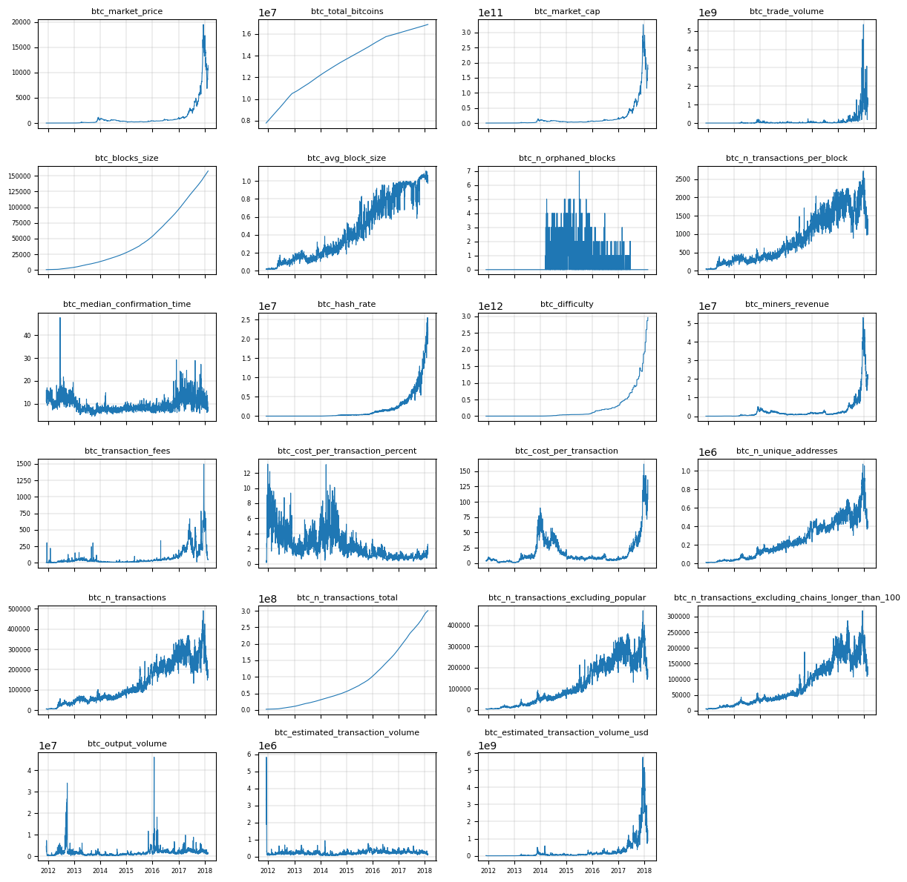
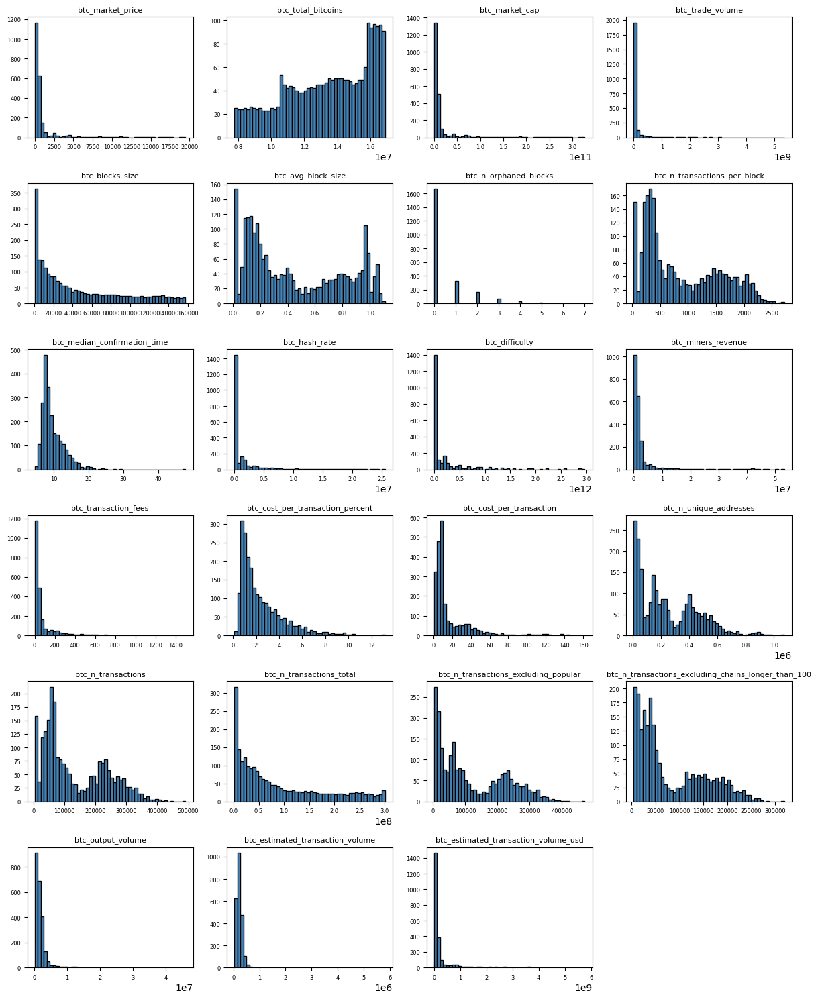
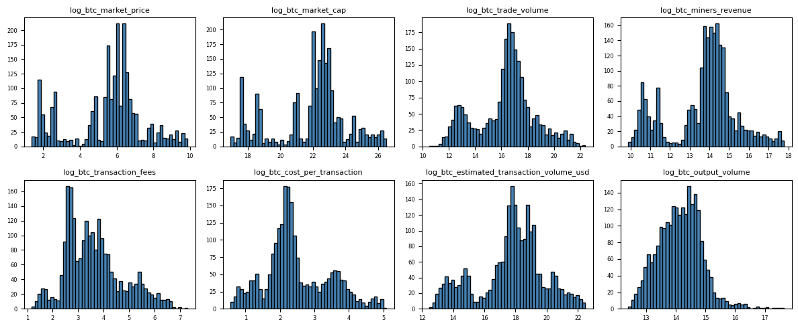
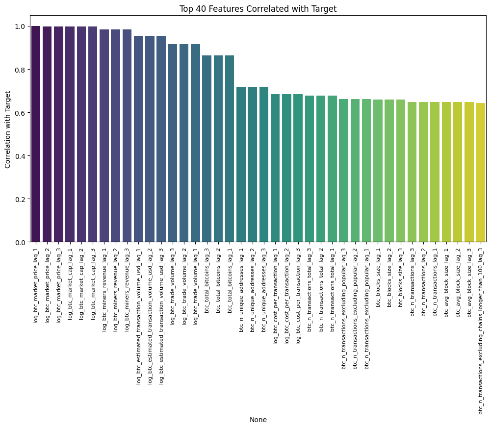
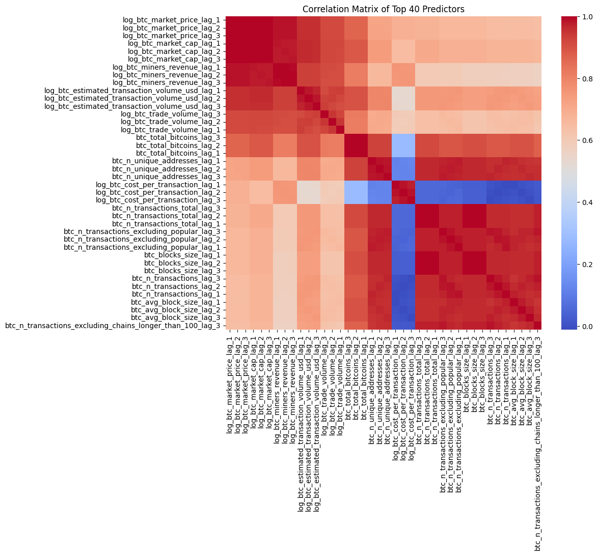
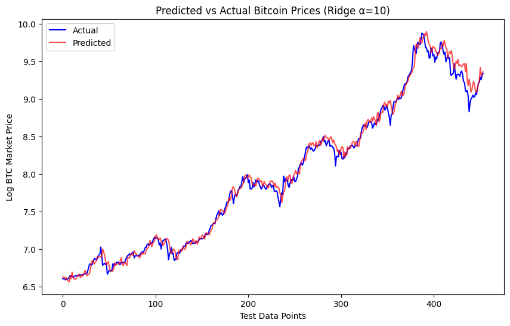
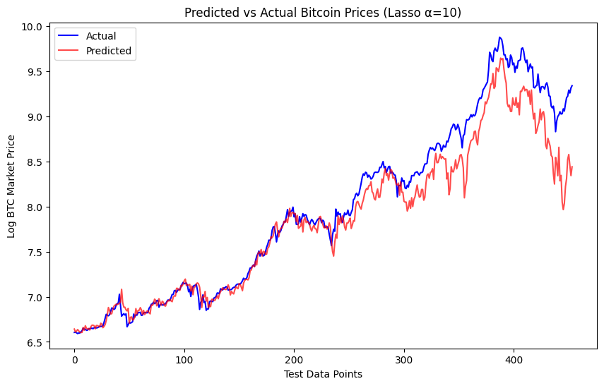
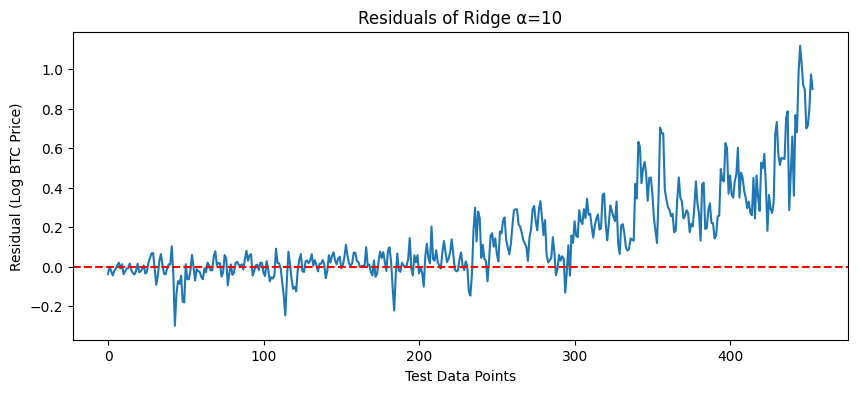

# Bitcoin Price Prediction Report

By: Zarmeen Hasan

## Introduction

This report goes over my process for determining the best model for predicting the next day's Bitcoin price. I use the Bitcoin dataset provided in the assignment's instructions. The data contains variables such as Bitcoin market price, market cap, trade volume, cost per transaction, number of transactions, etc. The goal of the project is to predict hte Bitcoin market price (`btc_market_price`). This dataset is a time-series dataset so I use lag features (i.e. previous days' data) in order to predict the next day's price.

In the following sections I will walk through the data cleaning, data analysis, and model selection steps I took and finally end with my results and conclusion. All methodologies and practices use the concepts taught in the class thus far. Using these concepts, I conclude that the best model type (out of those taught in class) to predict Bitcoin market price is Ridge regression.

## Data Cleaning Process

### Missing and Zero Values

The first thing I checked for was missing values in the data. Luckily, there was only one variable with 21 missing values: `btc_trade_volume`. Because this is a time-series dataset, it's risky to simply remove these rows. Removing rows could result in gaps in the timeline. Thus, I performed a forward fill on the missing `btc_trade_volume`values. This means, days when `btc_trade_volume` is missing, they'll now be populated by the `btc_trade_volume` value from the day before.

The second thing I checked for was values less than or equal ot zero. It's important to check for negative values because in the context of the data, it would not make sense. There can never be a negative price of Bitcoin or a negative number of transactions. I did not find any negative values in the data. However, I did find zeros in the data: 

```
Columns with 0.0 values:  Index(['btc_market_price', 'btc_market_cap', 'btc_trade_volume',
       'btc_blocks_size', 'btc_n_orphaned_blocks',
       'btc_median_confirmation_time', 'btc_miners_revenue',
       'btc_transaction_fees', 'btc_cost_per_transaction',
       'btc_estimated_transaction_volume_usd'],
      dtype='object')
```

Looking through these columns, it would only make sense for `btc_n_orphaned_blocks` to have zero values on days there were no blocks orphaned. The rest cannot be zero because Bitcoin prices never reach zero. Bitcoin is so volatile and it will always have some value associated with it. This made me wonder if these values were only zero in early years when the Bitcoin did not exist or there were no transactions that day. These are the date ranges when each variable has zeros: 

```
Column 'btc_market_price' has 0 values from 2010-02-23 00:00:00 to 2010-08-16 00:00:00
Column 'btc_market_cap' has 0 values from 2010-02-23 00:00:00 to 2010-08-16 00:00:00
Column 'btc_trade_volume' has 0 values from 2010-02-23 00:00:00 to 2010-07-16 00:00:00
Column 'btc_blocks_size' has 0 values from 2010-02-23 00:00:00 to 2010-07-13 00:00:00
Column 'btc_n_orphaned_blocks' has 0 values from 2010-02-23 00:00:00 to 2018-02-20 00:00:00
Column 'btc_median_confirmation_time' has 0 values from 2010-02-23 00:00:00 to 2011-12-01 00:00:00
Column 'btc_miners_revenue' has 0 values from 2010-02-23 00:00:00 to 2010-08-16 00:00:00
Column 'btc_transaction_fees' has 0 values from 2010-02-23 00:00:00 to 2010-11-25 00:00:00
Column 'btc_cost_per_transaction' has 0 values from 2010-02-23 00:00:00 to 2010-08-16 00:00:00
Column 'btc_estimated_transaction_volume_usd' has 0 values from 2010-02-23 00:00:00 to 2010-08-16 00:00:00
```

Majority of the variables have only have zeros in 2010. This was very early on in the data's history, meaning the Bitcoin might not have existed then, so the zeros are justified. I already determined `btc_n_orphaned_blocks` can be zero, but `btc_median_confirmation_time` can only be zero if there were no transactions that day. We already know `btc_n_transactions` has no zero nor missing values, so rows where `btc_median_confirmation_time` are zero should be considered "bad" rows. I filtered out rows where the following variables were zero:

- `btc_market_price`
- `btc_market_cap`
- `btc_trade_volume`
- `btc_blocks_size`
- `btc_median_confirmation_time`
- `btc_miners_revenue`
- `btc_transaction_fees`
- `btc_cost_per_transaction`
- `btc_estimated_transaction_volume_usd`

### Duplicate Rows

I finally checked for duplicate rows as these would introduce noise and bias when creating lag features, but there were none. 

## Data Analysis & Model Selection

### Variable Trends Over Time

To get a better understanding of time-related trends for each variable, I plotted each variable by `Date`:



I was not too concerned about outliers because financial data in general can be very volatile. Especially with Bitcoin, price and activity can vary drastically by day. Thus, I decided to leave all outliers alone.

### Variable Distributions

I next looked at each variable's distribution to identify variables that were highly-skewed.



Several variables are highly skewed to the right including the target `btc_market_price`. I decided to perform log transformations on the highly skewed variables to stabilize variance. I was planning on looking at linear regressions, ridge regressions, and lasso regressions. All three of these regressions require stable variances. Linear Regression assumes residuals to have constant variance. Skewed predictors can lead to heteroscedasticity, where errors grow tih the magnitude of the predictor. It also minimizes the sum of squared errors so the extreme values do not dominate teh fit. Both Ridge and Lasso regression penalize large coefficients. If a predictor is highly skewed, its scale may be much larger than others, causing Ridge or Lasso to penalize it incorrectly.

After performing log transformations on the select variables, these were their new distributions:



I used the new transformed features instead of their old ones, so I just removed the old features from the modeling data. Note that the target is now `log_btc_market_price`.

### Lag Features & Train/Test Split

I created lag features for all of the variables (except `Date`). I used lags of 1, 2, and 3. I wanted to keep the number of lags fairly row to prevent the number of features from exploding. I made sure to shift the data by the lags so the model is always predicting future price. I also shifted the target variable for this reason. I had to drop the `NaN` values due to lagging.

In order to maintain the time-series component of the data, I had to split the data in chronological order. This means the first 80% of the data became the train set and the last 20% of the data became the test set.

### Identifying Correlations

With the lag features, there were now 69 predictors in the model. Viewing a correlation matrix for all 69 x 69 variables would be tricky, so I decided to first identify the top 40 features correlated with the target.



It makes sense that the top few correlated features are the lags of the target. I Then decided to create a correlation matrix for the top 40 predictors: 



Many of hte features are highly correlated with each other. This is understandable since they are lags of similar variables. This implies that there is a risk of multicollinearity. However, Ridge and Lasso regression both have their own ways of dealing with colinear predictors, so I decided to leave these as is for now.

### Fit the Baseline Model

To start off, I fit a MLR on all of the lag features. I wanted to use this as a baseline model to compare the rest of the models to. The other Ridge and Lasso fits should be better performing than the MLR.

I then fit Lasso and Ridge regressions using different α values. For Ridge, I tested αs equal to 0.1, 1, 10, and 100. For Lasso, I tested αs of 0.01, 0.1, 10, and 100. I decided to include 0.01 for the Lasso fits because Lasso is generally more aggressive in shrinking coefficients compared to Ridge. Smaller α values allow Lasso to retain more features before driving coefficients to zero, which can be important for capturing predictive signal in the data. By including 0.01, I was able to see how the model behaves when the penalty is very weak and compare it to the stronger regularization effects at higher α values.

## Results

### Model Comparison

These were the model results for all of the models I fit:

| Model        | α | Train MSE       | Test MSE        | Train R²       | Test R²    |
|-------------|-------|----------------|----------------|----------------|---------------|
| MLR         | -     | 0.004433       | 0.232247       | 0.998365       | 0.749542      |
| Ridge       | 0.1   | 0.004118       | 0.066503       | 0.998481       | 0.928282      |
| Ridge       | 1     | 0.004325       | 0.048231       | 0.998405       | 0.947988      |
| Ridge       | 10    | 0.005082       | 0.008136       | 0.998125       | 0.991226      |
| Ridge       | 100   | 0.008897       | 0.213776       | 0.996718       | 0.769461      |
| Lasso       | 0.01  | 0.004462       | 0.005973       | 0.998354       | 0.993558      |
| Lasso       | 0.1   | 0.014388       | 0.047957       | 0.994693       | 0.948283      |
| Lasso       | 1     | 1.004391       | 3.800743       | 0.629524       | -3.098767     |
| Lasso       | 10    | 2.711082       | 10.221286      | 0.000000       | -10.022758    |
| Lasso       | 100   | 2.711082       | 10.221286      | 0.000000       | -10.022758    |

Overall, both Ridge and Lasso clearly outperform the MLR baseline by controlling overfitting and improving generalization. Ridge regression with α = 10 and Lasso regression with α = 0.01 both achieve excellent test performance, with Lasso slightly edging out Ridge in terms of R². However, Ridge shows more stability across different regularization strengths, while Lasso is highly sensitive to the choice of α. Given this trade-off, Ridge (α = 10) can be considered the most reliable model, whereas Lasso (α = 0.01) achieves the absolute best accuracy but may be less robust to changes in the data or parameter settings.

### Residuals of Best Lasso and Ridge Fits

To determine which model out of the two top models is best, I looked at the predicted vs. actual plots for both models.





Based on the above plots, it's clear the Ridge model is better at predicting Bitcoin market price with more recent data. My final selected model is the Ridge model with α = 10. The final check I did was look at the residuals for this model. 




Overall, the residuals look randomly distributed around 0 except as the model uses more recent data, the residuals grow. This means that the model is underestimating the increases in Bitcoin market price during more recent periods of time. Since the residuals seem to have a upward trend here, it suggests some nonlinearity.

## Conclusion

This project applied multiple regression techniques to predict the next day’s Bitcoin market price. After cleaning the dataset, addressing missing/zero values, creating lag features, and applying log transformations, several models were compared: MLR, Ridge, and Lasso.

- The baseline MLR had high training accuracy but poor test performance, showing clear signs of overfitting.

- Lasso (α = 0.01) achieved the best test R², but its sensitivity to the choice of α raised concerns about stability.

- Ridge (α = 10) balanced bias and variance best, delivering consistently strong results and reliable generalization.

Overall, Ridge regression with α = 10 was chosen as the final model. While not flawless, it provides a solid linear baseline for forecasting Bitcoin prices and demonstrates the value of regularization in controlling multicollinearity and improving predictive accuracy.
